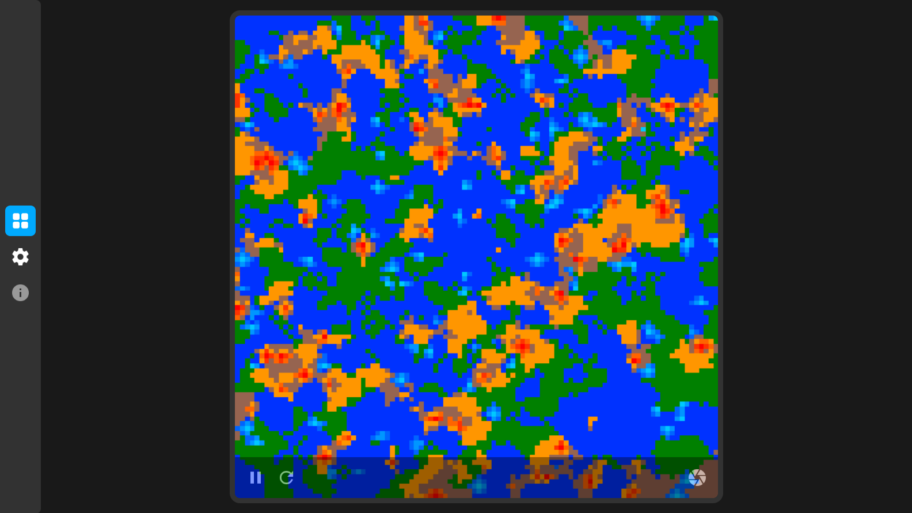

# Elements
A sandbox-style game.



- - -
## Guide
A sandbox game with an automatically generated board that you can run to observe the interactions between elements.

However, the main focus of the game is not on random board generation but on supporting custom code. You can edit or remove built-in elements, create your own, add interaction principles with other elements, and connect them to the board. User-created elements will also be generated on the board with a specified probability and fully supported by the game. The structure of elements and their interactions are contained in the file [`/scripts/elements.js`](./scripts/elements.js), which can be edited as desired.

To create custom elements, it is recommended to look at the code of the built-in elements or the example of a custom element below.
```js
//#region Custom element
/**
 * It is recommended to place each element in a separate region.
 * The element should inherit from the Elemental class.
 */
class CustomElement extends Elemental {
	/**
	 * Static private field for the element's name.
	 * @type {string}
	 */
	static #name = `Custom element`;
	/**
	 * Getter for the element's name.
	 * @readonly
	 * @returns {string}
	 */
	static get name() { return CustomElement.#name; }

	/**
	 * Static private field for the element's primary color.
	 * The primary color is shown in the element's avatar and may differ from the current color.
	 * @type {Readonly<Color>}
	 */
	static #color = Object.freeze(Color.viaRGB(0, 0, 0));
	/**
	 * Getter for the element's primary color.
	 * @readonly
	 * @returns {Readonly<Color>}
	 */
	static get color() { return CustomElement.#color; }

	/**
	 * Metadata for one of the element's abilities.
	 * Metadata should include a name, description, and preparation time.
	 * @type {AbilityMetadata}
	 */
	static #metaAbility = new Ability.Metadata(`Ability`, `Description`, 1);
	/**
	 * Static private field for the metaset for all abilities.
	 * @type {Readonly<AbilityMetadata[]>}
	 */
	static #metaset = Object.freeze([CustomElement.#metaAbility]);
	/**
	 * Getter for the metaset.
	 * @readonly
	 * @returns {Readonly<AbilityMetadata[]>}
	 */
	static get metaset() { return CustomElement.#metaset; }

	/**
	 * One of the element's abilities.
	 * The ability should use metadata for initialization.
	 * It also includes an action to be performed when the ability is used.
	 * @type {Ability}
	 */
	#ability = new Ability(CustomElement.#metaAbility, (invoker) => {
		// Actions are described here
		
		/**
		 * This function should be called to mark that a change has occurred,
		 * indicating that the ability usage has affected something.
		 */
		invoker.change();
	});
	/**
	 * Private field for the list of all abilities.
	 * @type {Readonly<Ability[]>}
	 */
	#abilities = Object.freeze([this.#ability]);
	/**
	 * Getter for the abilities list.
	 * @readonly
	 * @returns {Readonly<Ability[]>}
	 */
	get abilities() { return this.#abilities; }

	// Additionally, other properties of the class such as color, position can be overloaded...
}
/**
 * After creating the element, it should be added to the board with a specified probability of its appearance.
 */
board.cases.set(CustomElement, 50);
//#endregion
```
- - -

## Feed
### 2.9.3 : Adaptive Core 2.8.6 (27.05.2024)
- Added element descriptions.
- Added element information page.

### 2.9.1 : Adaptive Core 2.8.3 (26.05.2024)
- Gameplay screenshot updated.
- FPS counter appearance improved.
- Guide added to [`/README.md`](./README.md)

### 2.9.0 : Adaptive Core 2.8.3 (25.05.2024)
- Core updated.
- Project rebuilt using the latest OOP structures.
- Rendering optimized by approximately 30%.
- Documentation for internal structures added.
- Fixed radius of the player corners.
- Fixed bug with player resizing.
- Fixed bug with page structure distortion.
- Smooth rendering of elements fixed.
- Page metadata improved.
- Design fixed for mobile devices.
- FPS counter color fixed.
- Player icon color fixed for light theme.
- Settings validation improved.
- Loading added.

### Update 2.6.4 (21.06.2023)
- Updated internal engine.
- Fixed design issues.
- Updated design layout.
- Improved adaptation for mobile devices.
- Enhanced internal modules.
- Changed rendering algorithm.
- Improved translation.

### Update 2.5.7 (17.05.2023)
- Improved internal engine.
- Fixed rendering issue.

### Update 2.5.5 (04.02.2023)
- Added the ability to take a snapshot of the board.
- Added the option to change the game loop in the settings.
- Fixed a version compatibility issue with settings.
- Improved design.

### Patch 2.5.3 (31.01.2023)
- Fixed design issues where the board with a size of 101 or larger would go beyond the page boundaries.
- Adapted the control panel to different themes.

### Update 2.5.2 - Custom code support (30.01.2023)
- Improved HTML structure.
- Changed the sandbox icon.
- Updated styles.
- Fixed design issues.
- Added code descriptions.
- Improved modules for easier operation.
- Enhanced code structure.
- Reduced code redundancy.
- Added full support for user scripts.
- Optimized element counter functionality.
- Improved theme settings.
- Enhanced error descriptions.
- Removed unstable functions.
- Added a sample of user code.

### Update 2.1.6 (20.11.2022)
- Added the ability to change the absolute frames per second (FPS) count in the settings menu.
- Accelerated the operation of settings and saves.
- Changed the icon on the main page.
- Added icons at the top of the pages.
- Activated a safe mode to preserve data integrity in case of errors.
- Available update check when connected to the internet from the settings menu.

### Update 2.1.3 (13.11.2022)
- Now it is possible to hide elements with a zero count in the element counter.
- Improved settings structure.
- Enhanced dropdown menu structure in the settings.

### Update 2.1.2
- Added a settings section.
- The theme can be changed in the settings.
- The FPS counter can be hidden or shown in the settings.
- The element counter can be hidden or shown in the settings.
- The board size can be changed in the settings.
- Fixed internal program structure.
- Fixed styles.
- Added effects.
- Fixed fonts.
- Added warning hints about data loss.
- Changed the color of the Dirt element (previously Void).
- Optimized program performance.
- Fixed the movement indicator for the board.

### Update 2.0.5
- Updated design.
- Added a dark theme (internal toggle).
- Changed the structure of the elements.
- Fixed an issue with incorrect layer rendering.
- Added small effects.

### Update 2.0.2
- Added color for the FPS counter.
- Added an element table.
- Improved board structure.

### Update 2.0.0
- The game has been rewritten in JS (with JSDoc support).
- The entire game structure has been changed.
- Dynamic internal interactions have been added (for now).
- Custom elements have been added.
- The FPS counter has been added.

...